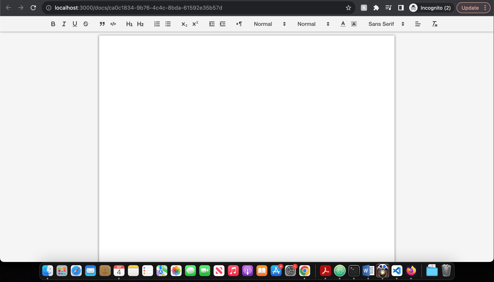
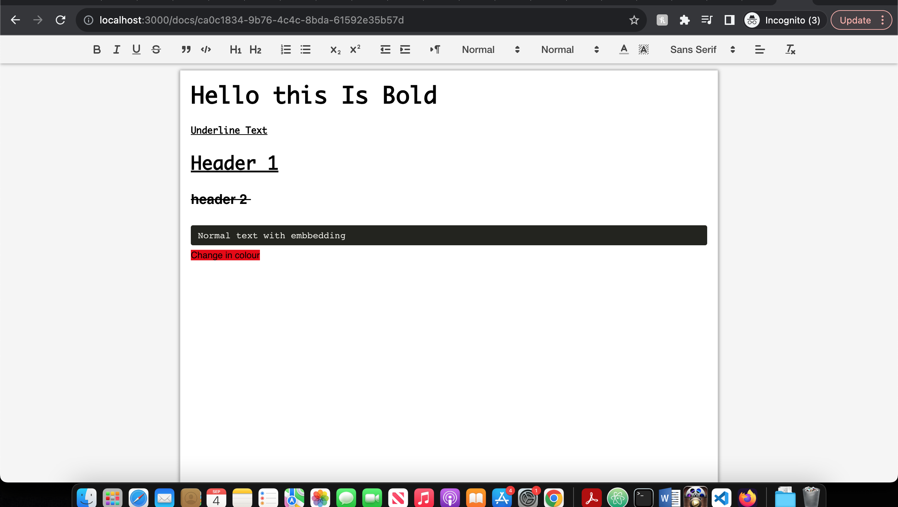
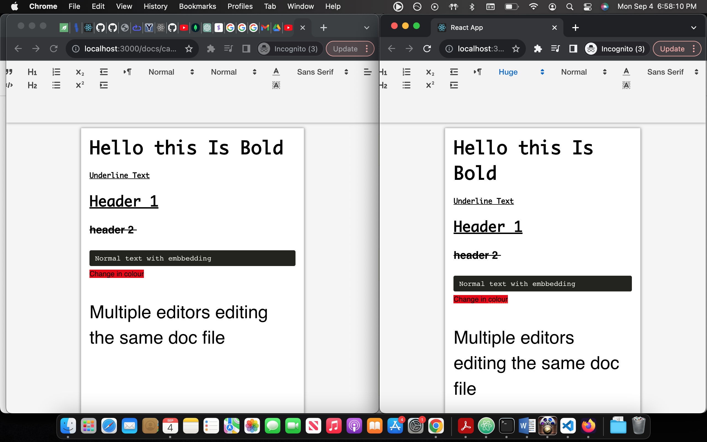

# Getting Started with Create React App

This project was bootstrapped with [Create React App](https://github.com/facebook/create-react-app).

## Available Scripts

# google-docs-clone

An online document editor simliar to google docs. Multiple users can edit the same document in real time enabled using Socket.io. The web app resembels the same layout as google docs with minimal formatting options. Quilljs API for programmatically manipulating the editor's content, selection, and configuration, enables a rich text editor and prevent the overriding of changes when multiple users edited the same document.

##  Technologies Used: 
Frontend: React.js & Material-UI

Backend: Socket.io

Database: MongoDB

###  Document 

### Document and its formatting options

### Multiple users editing the same document
 

In the project directory, you can run:

### `npm start`

Runs the app in the development mode.\
Open [http://localhost:3000](http://localhost:3000) to view it in your browser.

The page will reload when you make changes.\
You may also see any lint errors in the console.

### `npm run build`

Builds the app for production to the `build` folder.\
It correctly bundles React in production mode and optimizes the build for the best performance.

The build is minified and the filenames include the hashes.\
Your app is ready to be deployed!

See the section about [deployment](https://facebook.github.io/create-react-app/docs/deployment) for more information.

